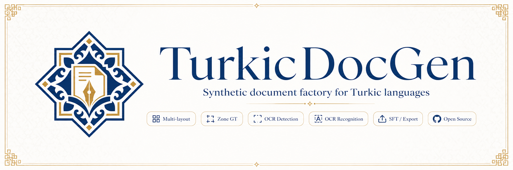

<p align="center">
  
</p>

<h1 align="center">TurkicDocGen</h1>

<p align="center">
  Procedural document generation factory for OCR and layout understanding datasets.
</p>

<p align="center">
  
  
  
</p>

---

<p align="center">
  <small>
    <a href="#overview">Overview</a> •
    <a href="#datasets">Datasets</a> •
    <a href="#capabilities">Capabilities</a> •
    <a href="#structure">Structure</a> •
    <a href="#getting-started">Getting Started</a> •
    <a href="#acknowledgements">Acknowledgements</a> •
    <a href="#citation">Citation</a> •
    <a href="#license">License</a>
  </small>
</p>

---

## Overview

**TurkicDocGen** is a procedural generation engine that renders high-fidelity synthetic document pages for training OCR and Document AI models. By utilizing a **zone-first rendering strategy**, it plans document semantics and layouts before rendering them onto a realistic canvas.
 
The engine features native support for **bilingual mixed-language structures** (Kazakh-Russian, Kyrgyz-Russian), **advanced physical wear simulation** (scanner noise, photo-erosion, stains), and an **interactive QA web panel** for real-time visual inspection.

## Datasets

The dataset is published on Hugging Face Hub and Kaggle Datasets:

<table>
  <thead>
    <tr>
      <th>Dataset</th>
      <th>Configuration</th>
      <th>Size</th>
      <th>Description</th>
      <th>Download Links</th>
    </tr>
  </thead>
  <tbody>
    <tr>
      <td rowspan="3"><b>TurkicOCR Synthetic Cyrillic Dataset</b></td>
      <td><code>tiny</code></td>
      <td>25,000 pages</td>
      <td rowspan="3">High-fidelity synthetic document pages for Kazakh, Kyrgyz, and Russian Cyrillic OCR and layout understanding.</td>
      <td rowspan="3">
        <a href="https://huggingface.co/datasets/alenisaw/turkicocr-cyrillic">Hugging Face Hub</a><br>
        <a href="https://www.kaggle.com/datasets/alenissayev/turkicocr-cyrillic">Kaggle Datasets</a>
      </td>
    </tr>
    <tr>
      <td><code>medium</code></td>
      <td>50,000 pages</td>
    </tr>
    <tr>
      <td><code>large</code></td>
      <td>100,000 pages</td>
    </tr>
  </tbody>
</table>

## Recognition Models

Accompanying line-grounded OCR models trained on this dataset are available in the [TurkicOCR-SVTRv2-B](https://github.com/alenisaw/turkicocr-svtrv2-b) repository:
* **PyTorch (FP32)**: [Hugging Face](https://huggingface.co/alenisaw/turkicocr-svtrv2-b) | [Kaggle](https://www.kaggle.com/models/alenissayev/turkicocr-svtrv2-b/PyTorch/default)
* **ONNX (FP32)**: [Hugging Face](https://huggingface.co/alenisaw/turkicocr-svtrv2-b-onnx) | [Kaggle](https://www.kaggle.com/models/alenissayev/turkicocr-svtrv2-b/Onnx/default)
* **ONNX (INT8)**: [Hugging Face](https://huggingface.co/alenisaw/turkicocr-svtrv2-b-int8) | [Kaggle](https://www.kaggle.com/models/alenissayev/turkicocr-svtrv2-b/Onnx/int8)

## Capabilities

The engine procedurally constructs pages using 29 layout templates and customizable physical degradation pipelines:

### Layout Categories
| Category | Layouts | Description |
| :--- | :--- | :--- |
| **Official & Forms** | `official_letter_page`, `memo_page`, `archival_notice_page`, `official_statement_page`, `meeting_minutes_page`, `simple_form_page`, `application_form_page`, `registry_extract_page` | Documents with headers, stamps, checkbox grids, and handwriting inputs. |
| **Books & Academic** | `book_page_single_column`, `book_page_two_columns`, `dictionary_entry_page`, `glossary_page`, `index_page`, `academic_abstract_page` | Classical text layouts, index lists, and multi-column paper abstracts. |
| **Specialized & Tables** | `syllabus_page`, `lecture_notes_page`, `exam_sheet_page`, `worksheet_page`, `invoice_like_page`, `receipt_like_page`, `catalog_entry_page`, `simple_table_page`, `schedule_table_page`, `wide_schedule_page`, `attendance_sheet_page` | Syllabi, exam sheets, itemized receipts, schedules, and grids. |

### Visual Degradation Effects
| Class | Effects | Simulation |
| :--- | :--- | :--- |
| **Scan & Wear** | Scanner noise, paper feed bands, printer streaks, photocopy erosion, yellowing, stains | Hardware defects, copying degradation, and environmental aging. |
| **Geometry** | Scanline jitter, perspective tilt, phone camera projection, lens defocus blur | Physical scanning vibration and smartphone camera optics. |
| **Authenticity** | Pen signatures, blue/red stamps | Handwritten signature strokes and official ink seals. |

## Structure

### Generated Output Files
* `images/` — Rendered pages in high-quality JPEG format.
* `manifest.jsonl` — Render configs, seeds, and metadata for each page.
* `zone_gt.jsonl` — Zone ground truth with bounding boxes, text lines, table cells, and reading order.
* `ocr_det.jsonl` / `ocr_rec.jsonl` — Pre-formatted detection and recognition exports.
* `sft.jsonl` — Prompt-response pairs for Document VLM fine-tuning.
* `reports/` — Validation checks and diversity audit reports.

### Workspace Layout
```text
src/turkicdocgen/
  cli.py              # CLI entrypoint
  dataset.py          # Generation & QA pipelines
  page_planning/      # Layout planners and bilingual text mixers
  render/             # Visual page rendering and physics-based effects
  web/                # Local FastAPI visualization panel
```

## Getting Started

```bash
# 1. Install package in editable mode
git clone https://github.com/alenisaw/turkic-docgen.git && cd turkic-docgen
pip install -e ".[dev]"

# 2. List available profiles
turkicdocgen profiles

# 3. Generate & validate a dataset
turkicdocgen pipeline --profile visual_300 --seed 42 --out outputs/my_run --force

# 4. Launch the local web panel (open http://127.0.0.1:7860)
turkicdocgen web --input outputs/my_run
```

## Acknowledgements

The author would like to thank the Research and Innovation Center "CyberTech" at Astana IT University for their support and resources during the creation of this dataset.

## Citation

```bibtex
@inproceedings{issayev2026turkicocr,
  title={TurkicOCR-SVTRv2-B: Lightweight Line-Grounded Recognizer for Kazakh and Kyrgyz Optical Character Recognition},
  author={Issayev, Alen and Zhalgas, Aidana},
  booktitle={Analysis of Images, Social Networks and Texts (AIST 2026)},
  series={Lecture Notes in Computer Science (LNCS)},
  publisher={Springer},
  year={2026},
  doi={10.1007/978-3-031-XXXXX-X_XX}
}

@misc{issayev_2026_turkicocr_cyrillic,
  author       = {Issayev, Alen},
  title        = {TurkicOCR-Cyrillic},
  year         = {2026},
  publisher    = {Hugging Face},
  doi          = {10.57967/hf/9255},
  url          = {https://huggingface.co/datasets/alenisaw/turkicocr-cyrillic},
  note         = {Synthetic Cyrillic OCR and document-understanding dataset}
}

@software{issayev_2026_turkicdocgen,
  author = {Issayev, Alen},
  title = {TurkicDocGen: Procedural Document Generation Engine for Turkic Languages},
  year = {2026},
  license = {Apache-2.0},
  url = {https://github.com/alenisaw/turkic-docgen}
}
```

## License

The code in this repository is distributed under the [Apache-2.0](LICENSE) license.

Generated datasets are distributed under the **CC BY 4.0** license (as specified in the project badges).
